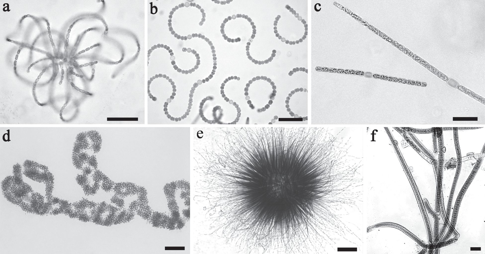

# Введение

В данной работе рассматриваются примеры исследований экосистемы озера Байкал, которые используют различные виды анализа данных. Материалы базируются на статьях, посвященных мониторингу цианобактерий и концентрации метана в водной толще.

**Ссылка на** [Github](https://github.com/igulyaew/RTest)

## 1. Описательный анализ

**Источник:** *Токсин-продуцирующие цианобактерии в озере Байкал и водоёмах Байкальского региона (обзор)*. Авторы: О. И. Белых, И. В. Тихонова, А. В. Кузьмин и др. (DOI: 10.25750/1995-4301-2020-1-021-027).

### Основные положения исследования
* **Период исследования:** 2005–2019 гг.
* **Объект описания:** Цианобактерии, продуцирующие опасные для здоровья токсины.
* **Ключевые факты:**
  * В водоёмах региона и прибрежной зоне Байкала зафиксировано превышение нормативов.
* **Результат:**
  * Описание и систематизация накопленных данных.
  * Отсутствует обобщение результатов (типично для чисто описательного анализа).

### Потенциально токсичные цианобактерии оз. Байкал

### Содержание токсинов цианобактерий в 2016–2017 гг.

| **Тип пробы, место отбора**              |  **Микроцистин** |  **Сакситоксин**  |
|------------------------------------------|:----------------:|:-----------------:|
| Вода, залив Мухор                        |  0,97–1200 нг/л  |        Н.о.       |
| Вода, Посольский сор                     |       Н.о.       |      15 нг/л      |
| Биоплёнки, Листвянка                     |  0,3–2,35 нг/мг  |   8,3–42,6 нг/мг  |
| Биоплёнки, Большие Коты                  | 0,066–1165 нг/мг | 0,378–123,3 нг/мг |
| Детрит, Большое Голоустное               |     68 нг/мг     |        Н.о.       |
| Биоплёнки, Ольхонские Ворота             |   29–448 нг/мг   |        Н.о.       |
| Биоплёнки, мыс Толстый                   |       Н.о.       |  15,0–158,6 нг/мг |
| Биоплёнки, бухта Ая                      |    20–40 нг/мг   |  116,8–3572 нг/мг |
| Природная колония *Nostoc pruniformе*    |  0,422–27 нг/мг  |   3,8–54,2 нг/мг  |
| Природная колония *Tolypothrix distorta* |     135 нг/мг    |     0,9 нг/мг     |

### Математическое обоснование
Для описательного анализа концентраций токсинов рассчитываются базовые статистики. Например, средняя концентрация токсина $\bar{X}$ в пробах воды вычисляется по формуле:

$$ \bar{X} = \frac{1}{n} \sum_{i=1}^{n} x_i $$

где $x_i$ — значение концентрации в $i$-й пробе, $n$ — общее число проб.

## 2. Причинно-следственный анализ

**Источник:** *Причины и последствия повышения концентрации метана в воде оз. Байкал*. Авторы: Н. Г. Гранин, О. Ф. Верещагина, В. В. Блинов и др.

### Этапы и результаты исследования

1. **Период исследования:** 2013–2016 гг.
1. **Выявление фактора влияния:** строительство и режим работы Иркутской ГЭС привели к искусственному повышению уровня озера.
1. **Установление причинно-следственной связи:** рост уровня воды \rightarrow увеличение интенсивности выходов метана на поверхность.
1. **Оценка глобальных последствий:** влияние на изменение локального климата и экосистему.

Как отмечают авторы статьи:

> «Результаты молекулярно-биологических исследований показывают, 
> что во время близкое к времени катастрофического падения уровня (39-109 тысяч лет назад),
> появился новый вид – *малая голомянка* (Teterina et al., 2010). 
> Возможно это было последствием значительных выбросов метана из донных отложений обусловленных понижением
> уровня озера.»
